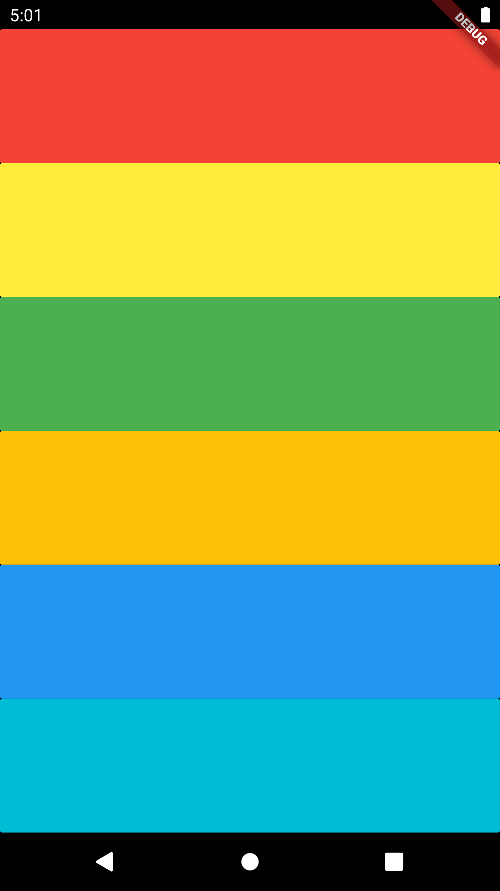

# Xylophone 🎹

A simple Xylophone APP that when colors are pressed it sound. (Using source libraries, generate repeated Widgets, Dart Functions)

This is a companion project to The App Brewery's Complete [Flutter Development Bootcamp](www.appbrewery.co).
